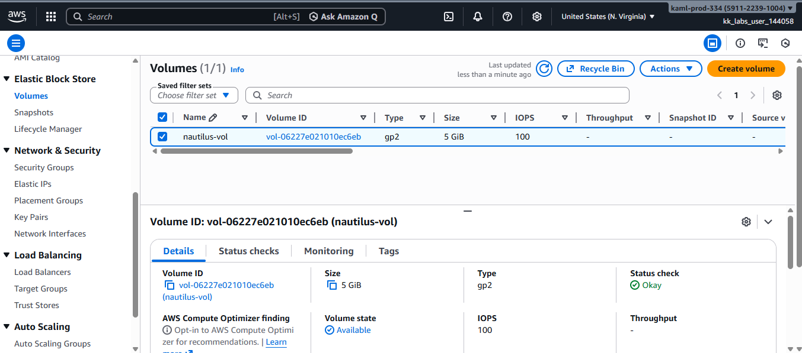
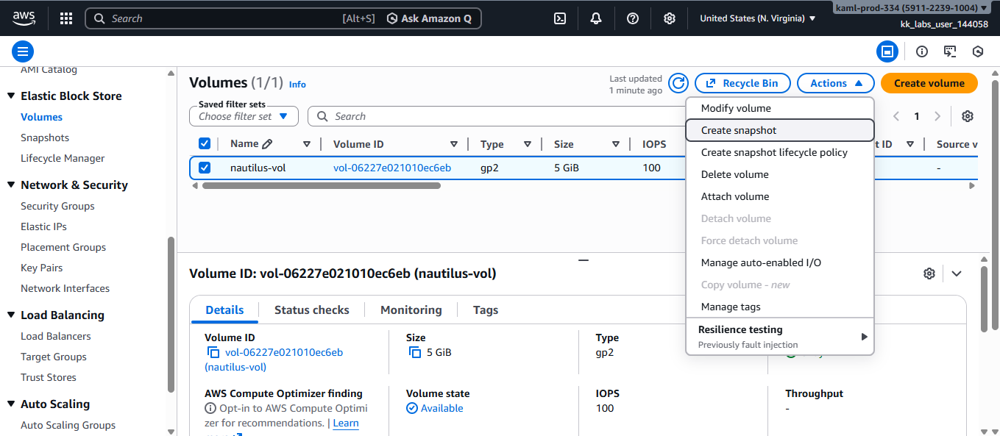
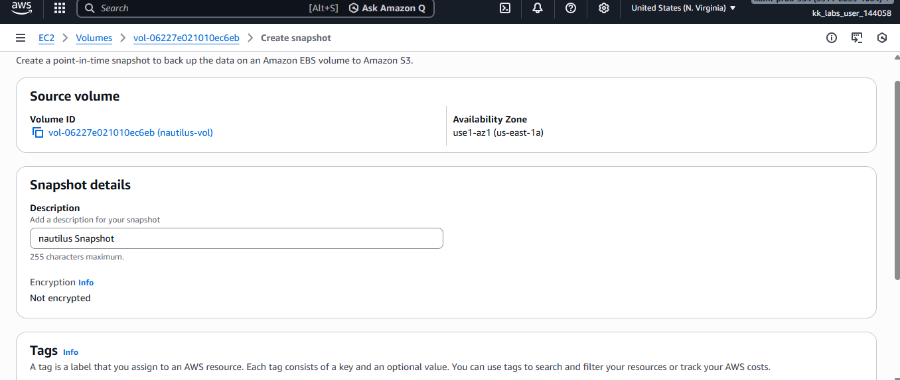
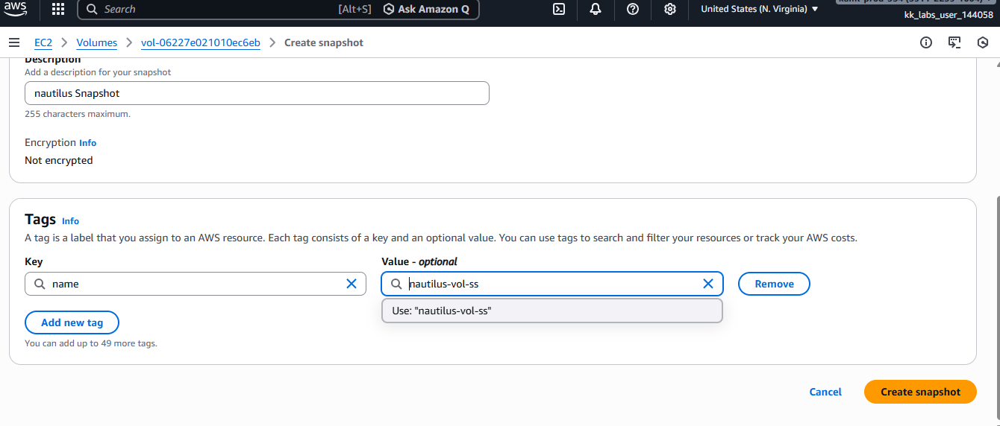
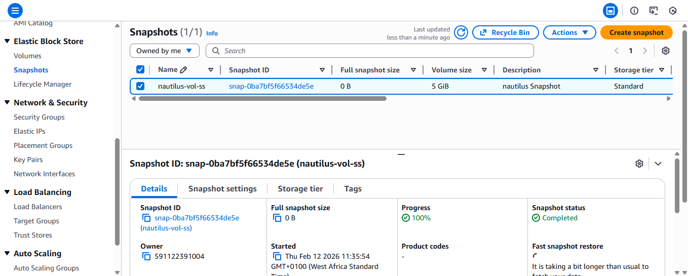

# AWS EBS Snapshot Creation 
This project demonstrates how to create a snapshot of an existing Amazon EBS volume in the **us-east-1 region** using the AWS Management Console.

## What is an EBS Snapshot?
An Amazon Elastic Block Store (EBS) Snapshot is a **point-in-time backup** of an EBS volume. Snapshots are stored in Amazon S3 and are used to preserve volume data for backup, disaster recovery, migration, and automation purposes.
Snapshots are **incremental**, meaning after the first snapshot, only changed data blocks are stored. This makes them storage-efficient and cost-effective.

## Step 1: Log in

Log in to AWS Management Console.

## Step 2: Locate the Volume

1. Navigate to **EC2 Dashboard**
2. Click: `Elastic Block Store → Volumes`
3. Search for the volume

## Step 3: Create the Snapshot

1. Select the volume `nautilus-vol`
2. Click **Actions**
3. Click **Create snapshot**

## Step 4: Fill in the required fields:

- **Tag Key:** `Name`
- **Tag Value:** 
- **Description:**  
Click **Create snapshot**

## Step 5: Verify Snapshot Status

1. Navigate to: `Elastic Block Store → Snapshots`
2. Locate snapshot `nautilus-vol-ss`
3. Confirm that the **State** shows: `completed`

##  Key Notes
- EBS snapshots are stored in Amazon S3.
- A volume can remain attached while a snapshot is being created.
- The "name" of a snapshot is configured using a tag with `Key = Name`.
- Snapshots can be used to create new volumes in the same or different Availability Zones.
- Snapshots support disaster recovery and migration strategies in production environments.

